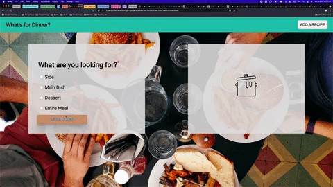

# Title
What's for Dinner?

## Table of Contents
  - [Abstract](#abstract)
  - [Technologies](#technologies)
  - [Code Architecture](#code-architecture)
  - [Illustrations](#illustrations)
  - [Install + Setup](#set-up)
  - [Contributors](#contributors)
  - [Wins](#wins)
  - [Challenges + Improvements](#challenges-+-Improvements)
  - [Project Specs](#project-specs)

## Abstract
I built this app as a resource for the perpetually hungry & terminally indecisive, and as a sandbox for my learning in front-end technologies (especially CSS).

## Technologies
  - CSS
  - JavaScript
  - HTML

## Code Architecture

## Illustrations

## Install + Setup
Clone this repository to your local machine and open the index.html file in your browser.

## Contributors
  - [Nolan Caine](https://github.com/n0land0)

## Wins
	- What went well!
	- Successes

## Challenges + Improvements
	- What was difficult & how you would like to improve on code/project
	- Any Bugs
	- Future Iterations

## Project Specs
  - The project spec & rubric can be found [here](https://frontend.turing.edu/projects/module-1/dinner.html)
